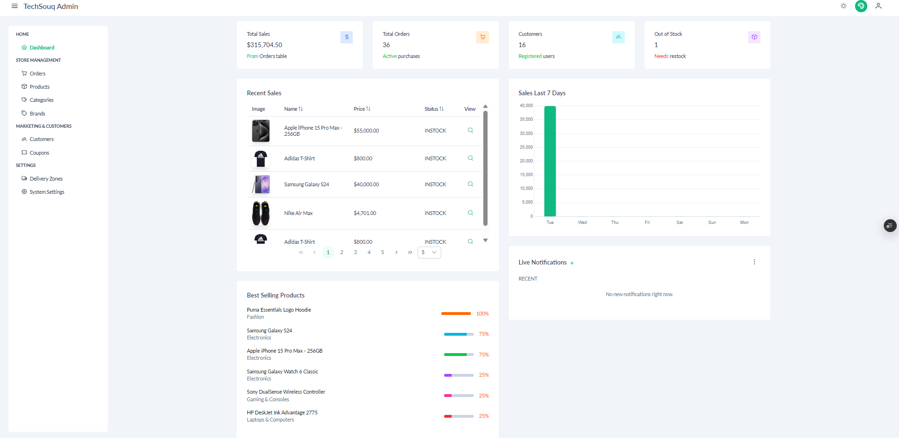
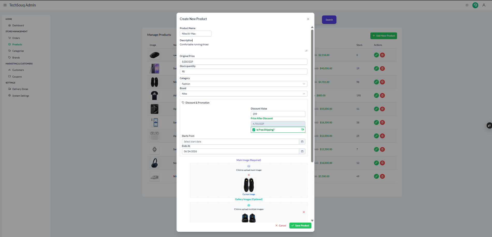
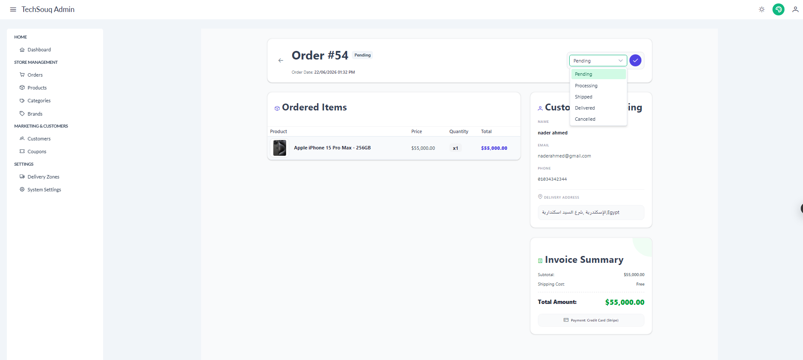

# TechSouq Admin Dashboard 📊

A highly optimized, modern, and secure admin control panel for the TechSouq E-commerce platform. Built with cutting-edge **Angular 21** and **PrimeNG**, this dashboard provides administrators with real-time insights, comprehensive catalog management, and seamless order processing capabilities.

🚀 **Live Dashboard:** [tech-souq-dashboard.vercel.app](https://tech-souq-dashboard.vercel.app/)

## 📸 System Previews

*(Place your screenshots here by replacing the paths once uploaded)*

## 🏗️ Architecture & Modern Angular Features
* **Zoneless Change Detection:** Configured with `provideZonelessChangeDetection()` for maximum performance and reduced bundle size (No `zone.js` dependency).
* **Standalone Components:** Fully utilizing the modern Angular Standalone architecture without `NgModules`.
* **Optimized HTTP Client:** Configured with `withFetch()` for native fetch API utilization, improving request performance.
* **Smart UI Foundation:** Built upon a heavily customized version of the PrimeNG **Sakai** template, adapted with the modern **Aura Theme** and fully responsive design (with Dark/Light mode toggle).

## 🔐 Security & State Management
* **Role-Based Route Guards:** Implemented strict `CanActivateFn` (AdminGuard) to protect routes, validating JWT tokens and checking `roleId` directly from secure local state before allowing navigation.
* **HTTP Interceptors:** Custom `authInterceptor` that seamlessly attaches secure HttpOnly credentials and auth tokens to every outgoing API request.
* **SignalR WebSockets:** Established a persistent WebSocket connection to the backend to receive **Live Notifications** (e.g., "New Order Placed") instantly without manual page refreshes.

## ✨ Comprehensive Modules & Features

### 📈 1. Analytics & Real-Time Monitoring
* Interactive **Chart.js** graphs for weekly sales and revenue tracking.
* Best-selling products progress bars and out-of-stock alerts.
* Live WebSocket-powered activity feed for incoming orders.

### 📦 2. Catalog & Inventory Management
* **Products:** Complex, reactive dynamic forms for creating/editing products with **Quill Editor** for rich text descriptions.
* **Media Uploads:** Dual-image upload system (Main Image + Gallery) interacting seamlessly with Cloudinary API.
* **Categories & Brands:** Full CRUD operations with visual UI grids and icon mapping.

### 🛒 3. Order Processing Center
* Detailed data tables featuring server-side pagination, sorting, and status toggles.
* Deep-dive views into customer shipping details, comprehensive invoice summaries, and ordered items tracking.

### 🎁 4. Marketing & System Settings
* **Coupons Management:** Configure dynamic discount rules (Percentage vs. Fixed Amount), usage limits, and expiration dates.
* **Delivery Zones:** Manage dynamic shipping costs per city/region.
* **System Settings:** Control global application flags like dynamic Free Shipping thresholds.
* **Customer Base:** View and manage registered user profiles and access levels.

## 🛠️ Core Tech Stack

* **Framework:** Angular v21
* **UI Component Library:** PrimeNG v21 (Aura Theme)
* **Styling & CSS:** Tailwind CSS v4 + PrimeUI Tailwind plugin.
* **Real-time Engine:** `@microsoft/signalr` v10 for live WebSockets.
* **Data Visualization:** Chart.js
* **Rich Text Editing:** Quill Editor

## ⚙️ How to Run Locally

1. Clone the repository: `git clone https://github.com/Hosny-Ayman/TechSouq-Admin.git`
2. Install dependencies: `npm install`
3. Configure Environment variables: Ensure your `environment.ts` points to the local or live .NET API URL.
4. Start the development server: `npm start` (Runs on port 4201 by default).
